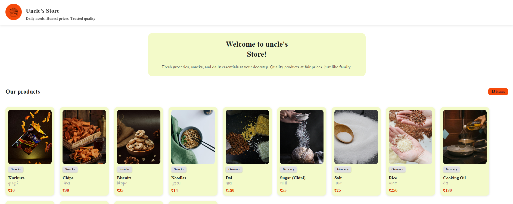

# 🛒 Uncle Kirana Store


A clean and responsive **frontend grocery store website** built using **HTML and CSS**.  
This project focuses on layout, UI clarity, and scalability for future JavaScript features.

---

## 📸 Project Preview



> Current UI preview showing header and welcome section.

---

## 📌 About The Project

**Uncle Kirana Store** is a frontend learning project that represents a local grocery store website.  
The goal of this project is to build a **realistic, scalable UI** step by step while learning frontend fundamentals properly.

Currently implemented:
- Sticky header with store logo and name  
- Store tagline below the title  
- Welcome section with description  
- Mobile responsive layout using media queries  

This project will gradually evolve into a **fully interactive store UI**.

---

## 🧱 Tech Stack

- **HTML5** – Semantic structure  
- **CSS3** – Styling and layout  
- **Flexbox** – Alignment and positioning  
- **Media Queries** – Mobile responsiveness  

---

## 📁 Folder Structure
```
uncle-kirana-store/
|
|-- index.html
|-- style.css
|-- script.js
|
|-- images/
| |-- icon.png
| |-- preview.png
```

---

## ✨ Features (Current)

- Sticky navigation header  
- Logo inside circular background  
- Store name with tagline  
- Welcome section UI  
- Clean color palette  
- Responsive for small screens  

---

## 🔮 Planned Improvements

- Add **"My Cart" button**
- Implement **JavaScript cart logic**
- Item price calculation
- Product listing section
- Better responsive layout (tablet & mobile)
- UI animations and interactions

---

## 🚀 Live Demo

🔗 _Coming soon (will be added after project completion)_

---

## 👨‍💻 Author

**Ajeet Yadav**  
Frontend Developer (Learning & Building Projects)

---

## ⭐ Note

This project is actively being developed and updated regularly.  
More features, improvements, and optimizations will be added over time.

