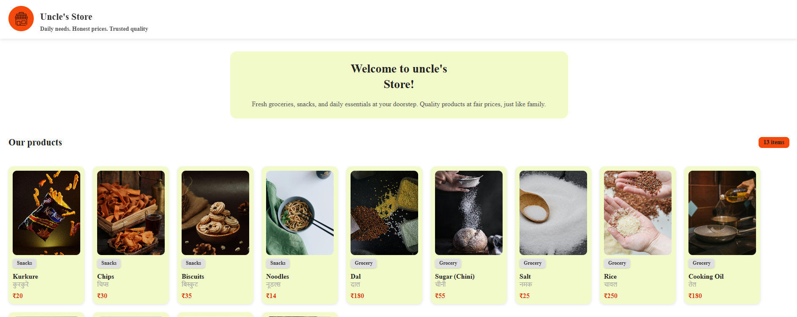

# 🛒 Uncle Kirana Store


A clean and responsive **frontend grocery store website** built using **HTML**, **CSS**, and **JavaScript**, with plans to integrate backend functionality in the future.  
This project focuses on layout, UI clarity, dynamic rendering, and scalable frontend architecture.

---

## 📸 Project Preview



> Latest UI preview showing homepage and dynamic product section.

---

## 📌 About The Project

**Uncle Kirana Store** is a structured frontend project that simulates a local grocery store website.

The goal of this project is to:

- Build a realistic and scalable UI
- Practice responsive design
- Implement dynamic rendering using JavaScript
- Handle URL-based routing logic
- Maintain a clean and organized folder structure

This project will evolve into a **full-stack grocery store application** after backend integration.

---

## 🧱 Tech Stack

- **HTML5** – Semantic structure  
- **CSS3** – Styling and responsive layout  
- **JavaScript (ES6)** – Dynamic rendering & URL routing  
- **Flexbox** – Alignment and positioning  
- **Media Queries** – Mobile responsiveness  

---

## 📁 Folder Structure
```
uncle-kirana-store/
|
|-- index.html
|-- style.css
|-- script.js
|-- product.html
|-- product.css
|-- product.js
|
|-- images/
| |-- icon.png
| |-- preview.png
| |-- balaji.jpg
| |-- kurkure1.jpg
| |-- etc 
```

---

## ✨ Features Implemented

- Sticky navigation header  
- Logo inside circular background  
- Store name with tagline  
- Responsive layout  
- Category-based product navigation  
- Dynamic product rendering using JavaScript  
- URL parameter handling  
- Clean UI structure  

---

## 🔮 Future Backend Improvements

After completing backend learning, the following upgrades will be implemented:

- Backend integration (Node.js / Express)  
- Database connectivity (MongoDB or SQL)  
- User authentication system  
- Cart persistence with database  
- Order management system  
- Admin product management panel  
- API-based product fetching  

---

## 🚀 Live Demo

🔗 https://theajeetcodes.github.io/uncle-kirana-store/

---

## 📂 Source Code

🔗 https://github.com/theajeetcodes/uncle-kirana-store

---

## 👨‍💻 Author

**Ajeet Yadav**  

Frontend Developer | Building Scalable UI Projects  

Focused on clean UI, responsive design, and scalable frontend architecture.

---

## ⭐ Current Status

The frontend phase of this project has been completed.

Future development will resume after completing backend learning,
where full-stack functionality will be implemented.

